# GraalVM on Oracle's Ampere A1 Compute Platform with Autonomous Database

### Overview

Oracle recently introduced a partnership with Ampere Computing, Arm, GitLab, Jenkins, and others to accelerate the Arm developer ecosystem. Our goal is to offer enough Arm resources to develop your first application, test Arm at real world scale, and even build or port a production application.

Oracle Cloud Infrastructure's (OCI) new Ampere A1 Compute platform, based on the Ampere Altra processor, offers an unparalleled price-performance value proposition.  In combination with GraalVM Enterprise (included at no additional charge), Java applications deployed to Ampere A1 will enjoy the best performance at the lowest price of any cloud platform.  To start, you can access the industry’s most generous free tier offering with 4 cores and 24 GB of RAM of Ampere A1 Compute as part of our Always Free tier.

To get started, sign up [here](https://www.oracle.com/cloud/free/?source=:ow:o:bl:po:Modal&intcmp=:ow:o:bl:po:Modal)!

### Credits
The contents of this tutorial is based on a video originally recorded by **Oleg Šelajev** (see [link](https://www.youtube.com/watch?v=QP83j_Q0CjE&list=PLirn7Sv6CJgGEBn0dVaaNojhi_4T3l2PF&index=2)).


### Creating an Autonomous Database Instance on OCI

For complete steps to provision an Autonomous Database on OCI, see this [link](https://docs.oracle.com/en/cloud/paas/autonomous-database/adbsa/autonomous-provision.html#GUID-0B230036-0A05-4CA3-AF9D-97A255AE0C08).

Once you have the Autonomous Database provisioned, we'll need to download the credentials file.  

Login to your `Oracle Cloud Infrastructure` account.

1. From the main menu, click on `Oracle Database`, then `Autonomous Database`:

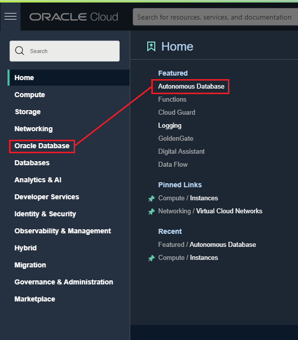

2. Click on the instance in the `Display Name` box:

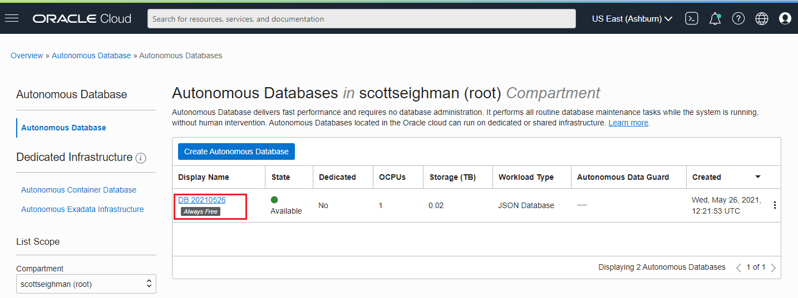

3. Click on the `DB Connection` button:

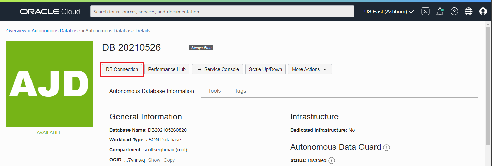

4. Click `Download Wallet`:

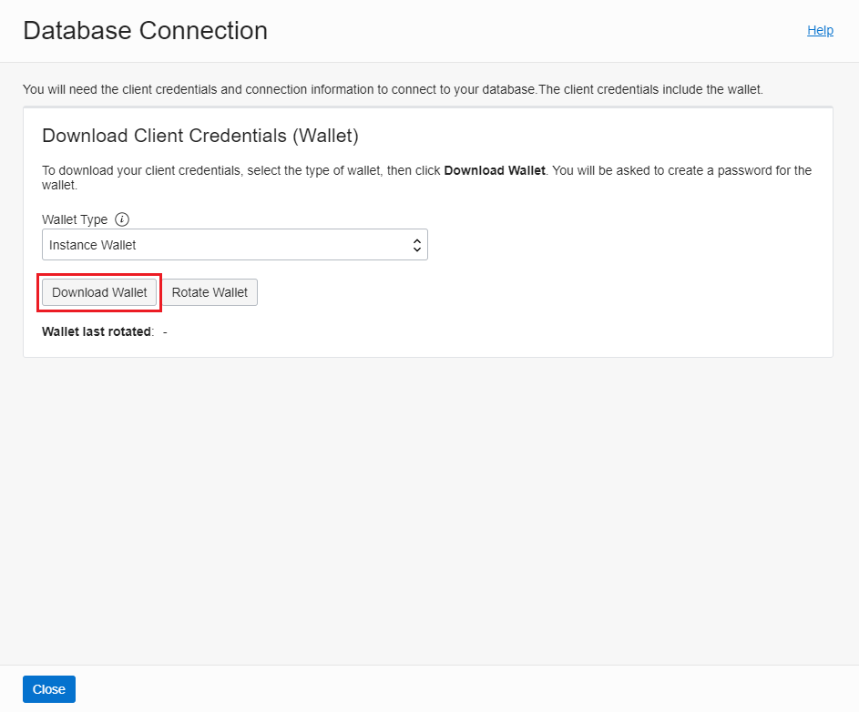

5. Enter a password and click the `Download` button:

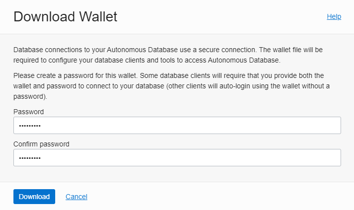

We'll use these crededntial files in steps after we provision the Ampere A1 instance.

Once you have an Autonomous Database running and the credentials downloaded, continue to the next steps.


### Create an Ampere A1 Instance on OCI

1. Login to your `Oracle Cloud Infrastructure` account.

2. Choose `Create a VM Instance` from Quick Actions:

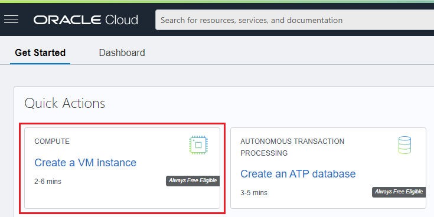

3. Click on the `Edit` button to configure the VM:

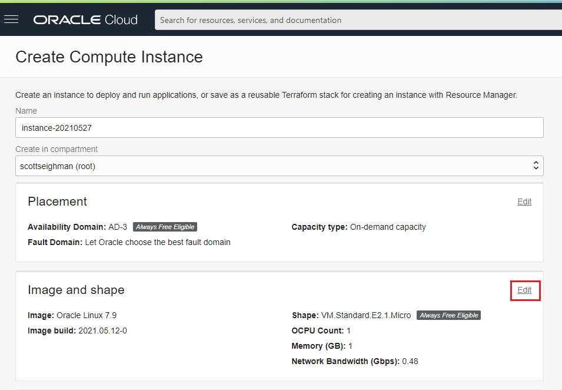

4. Click on the `Change Image` button:

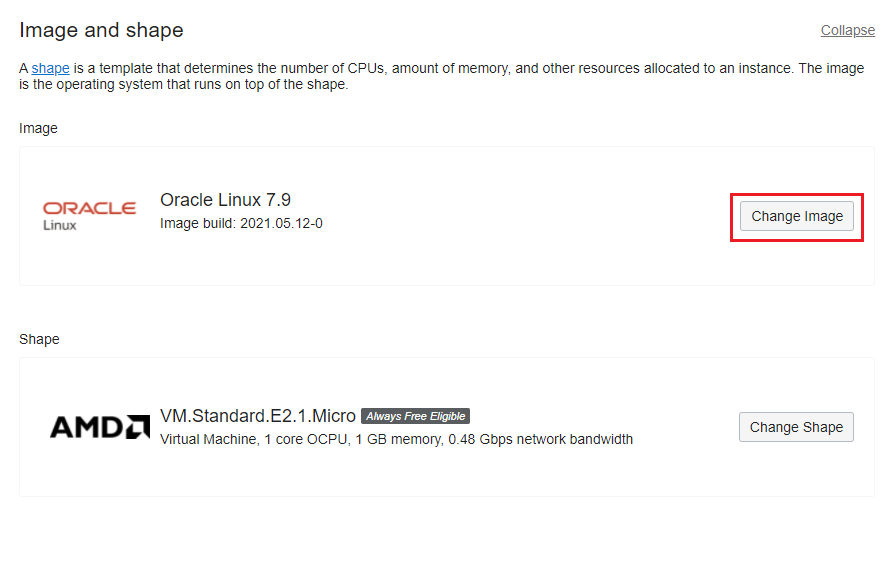

5. Choose `Oracle Linux` and `8` as the  OS Version and click `Select Image`:

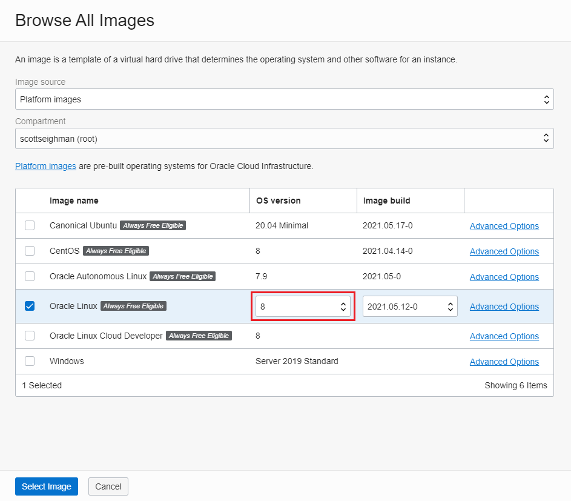

6. Next, click the `Change Shape` button:

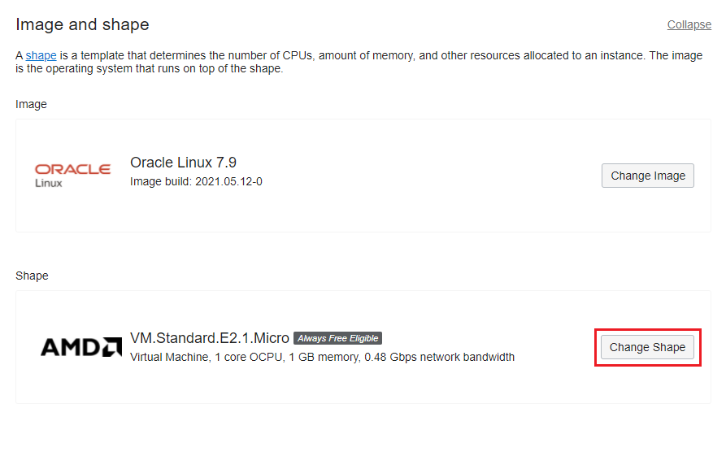

7. Choose `Ampere`, increase the OCPUs to `4` (which will automatically increase the memory to 24GB) and click on `Select Shape`:

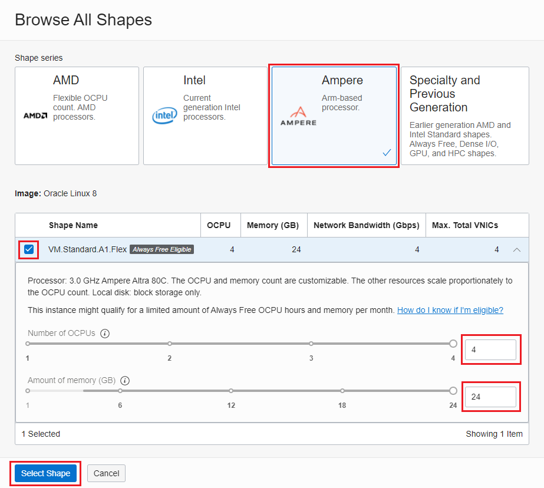


8. Scroll down and make certain to download your SSH Keys:

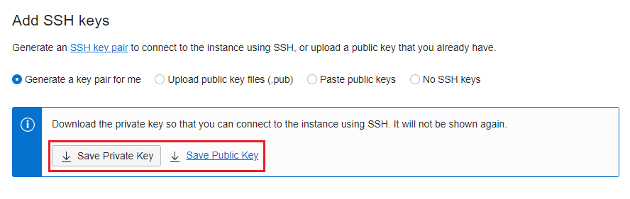

9. Click on the `Create` button to provision your Ampere A1 instance.

10. When the provisioing process is complete, you'll be presented with information about your instance, including the `Public IP Address` (you'll need to note that address for SSH access):

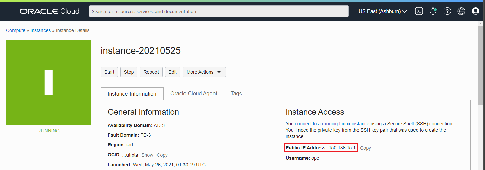

11. SSH into your new A1 instance using the keys you downloaded in the previous step:

```
$ ssh -i <path>/ssh-key-2021-05-26.key opc@150.136.15.1
Activate the web console with: systemctl enable --now cockpit.socket

Last login: Thu May 27 13:57:28 2021 from 76.188.6.8
[opc@instance-20210525 ~]$
```

12. Back on your local system (where you downloaded the wallet files), transfer the Wallet_DB20210526.zip file from your local system to your Ampere A1 instance:
```
$ scp -i ssh-key-2021-05-26.key <path>/Wallet_DB20210526.zip opc@150.136.15.1:/home/opc/wallet.zip
```

13. On the **A1 VM**, create a directory named `wallet`:
```
$ pwd
/home/opc
$ mkdir wallet
```
14. Unzip the contents of the wallet.zip to the `wallet` directory:

```
$ cd wallet
$ unzip ../wallet.zip
Archive:  ../wallet.zip
  inflating: README
  inflating: cwallet.sso
  inflating: tnsnames.ora
  inflating: truststore.jks
  inflating: ojdbc.properties
  inflating: sqlnet.ora
  inflating: ewallet.p12
  inflating: keystore.jks
  
```

15. In the wallet directory, edit `sqlnet.ora` and change the `DIRECTORY` parameter to reflect where you unzipped the credentials files:

```
WALLET_LOCATION = (SOURCE = (METHOD = file) (METHOD_DATA = (DIRECTORY="/home/opc/wallet")))
SSL_SERVER_DN_MATCH=yes
```

16. You'll also need to create the `TNS_ADMIN` environment variable and set it to the location of the credentials file:
```
$ export TNS_ADMIN=/home/ocp/wallet
```

17. Finally, we'll install **SQL*PLUS** client for **aarch64** (see [link](https://www.oracle.com/database/technologies/instant-client/linux-arm-aarch64-downloads.html)) to test our connection to the running database.

Once you have the client installed, we can test the connection.  In the credentials directory, the `tnsnames.ora` file contains the available connections.  You'll notice a number of connections with `_low, _medium, _high, _tp, _tpurgent` designations, you can choose any one of those connections.

For example:
```
db20210526_medium = (description= (retry_count=20) ... snip)
```

18. To connect to the Autonomous Database using `sqlplus`, enter the following command:
```
$ sqlplus ADMIN@db20210526_medium 

SQL*Plus: Release 19.0.0.0.0 - Production on Wed May 26 18:47:12 2021
Version 19.10.0.0.0

Copyright (c) 1982, 2021, Oracle.  All rights reserved.

Enter password:
Last Successful login time: Wed May 26 2021 18:19:39 +00:00

Connected to:
Oracle Database 19c Enterprise Edition Release 19.0.0.0.0 - Production
Version 19.5.0.0.0

SQL> SELECT TO_CHAR (SYSDATE, 'MM-DD-YYYY HH24:MI:SS') "NOW" FROM DUAL;

NOW
-------------------
05-26-2021 18:47:48

SQL> exit
Disconnected from Oracle Database 19c Enterprise Edition Release 19.0.0.0.0 - Production
Version 19.5.0.0.0
```

Congratulations, you now have an `Ampere A1 VM` running and a connection to an `Autonomous Database`!

### Install GraalVM on your Ampere A1 VM

1. If you're not already logged in, `ssh` to your **A1 VM**:

```
$ ssh -i <path>/ssh-key-2021-05-26.key opc@150.136.15.1
Activate the web console with: systemctl enable --now cockpit.socket

Last login: Thu May 27 13:57:28 2021 from 76.188.6.8
[opc@instance-20210525 ~]$
```
```
[opc@instance-20210525 ~]$ sudo yum check-update
[opc@instance-20210525 ~]$ sudo yum provides graalvm21-ee-11-jdk
Last metadata expiration check: 2:34:00 ago on Thu 27 May 2021 02:01:37 PM GMT.
graalvm21-ee-11-jdk-21.1.0-2.el8.aarch64 : Oracle GraalVM Enterprise Edition JDK11 Java Development Kit
Repo        : @System
Matched from:
Provide    : graalvm21-ee-11-jdk = 21.1.0
Provide    : graalvm21-ee-11-jdk = 21.1.0-2.el8

graalvm21-ee-11-jdk-21.1.0-2.el8.aarch64 : Oracle GraalVM Enterprise Edition JDK11 Java Development Kit
Repo        : ol8_oci_included
Matched from:
Provide    : graalvm21-ee-11-jdk = 21.1.0
Provide    : graalvm21-ee-11-jdk = 21.1.0-2.el8

```

2. Install the latest version of GraalVM:

```
[opc@instance-20210525 ~]$ sudo yum install graalvm21-ee-11-jdk
```

3. Configure your `PATH` and `JAVA_HOME` environment variables:

```
[opc@instance-20210525 ~]$ echo "export JAVA_HOME=/usr/lib64/graalvm/graalvm21-ee-java11" >> ~/.bashrc
[opc@instance-20210525 ~]$ echo 'export PATH=$JAVA_HOME/bin:$PATH' >> ~/.bashrc
[opc@instance-20210525 ~]$ source ~/.bashrc
```
4. Confirm Java is configured properly:

```
[opc@instance-20210525-2127 wallet]$ java -version
java version "11.0.11" 2021-04-20 LTS
Java(TM) SE Runtime Environment GraalVM EE 21.1.0 (build 11.0.11+9-LTS-jvmci-21.1-b05)
Java HotSpot(TM) 64-Bit Server VM GraalVM EE 21.1.0 (build 11.0.11+9-LTS-jvmci-21.1-b05, mixed mode, sharing)
```

5. Now let's install the `native-image` feature:

```
[opc@instance-20210525 ~]$ sudo yum update -y oraclelinux-release-el8
[opc@instance-20210525 ~]$ sudo yum config-manager --set-enabled ol8_codeready_builder
[opc@instance-20210525 ~]$ sudo yum install graalvm21-ee-11-native-image
```
6. Confirm it installed properly:
```
[opc@instance-20210525 ~]$ native-image --version
GraalVM 21.1.0 Java 11 EE (Java Version 11.0.11+9-LTS-jvmci-21.1-b05)
```

You can choose to add additional features, for complete directions, see this [link](https://docs.oracle.com/en/graalvm/enterprise/21/docs/getting-started/oci/compute-instances/).


### Build and Compile the Demo Application

1. First, clone the following repository:
```
$ git clone https://github.com/swseighman/GraalVM-A1-ADB.git
```
2. Change to the `GraalVM-A1-ADB` directory:

```
$ cd GraalVM-A1-ADB
```

3. Download the full OJDBC drivers from [here](https://www.oracle.com/webapps/redirect/signon?nexturl=https://download.oracle.com/otn/utilities_drivers/jdbc/122010/ojdbc8-full.tar.gz).

4. Unzip the drivers:
```
$ tar xzvf ojdbc11-full.tar.gz
ojdbc11-full/
ojdbc11-full/xdb.jar
ojdbc11-full/ojdbc11.jar
ojdbc11-full/oraclepki.jar
ojdbc11-full/osdt_core.jar
ojdbc11-full/ons.jar
ojdbc11-full/BASIC_LICENSE.txt
ojdbc11-full/ojdbc.policy
ojdbc11-full/orai18n.jar
ojdbc11-full/osdt_cert.jar
ojdbc11-full/README.txt
ojdbc11-full/rsi.jar
ojdbc11-full/ucp.jar
ojdbc11-full/simplefan.jar
ojdbc11-full/xmlparserv2.jar

```

5. Create a directory named `lib`:

```
$ mkdir lib
```

6. For simplicity, move the contents of `ojdbc11-full` to `lib`:

```
$ mv ojdbc11-full lib
```

7. Compile the application:

```
$ javac -cp ./lib/ojdbc11.jar:./lib/ucp.jar:./lib/oraclepki.jar:./lib/osdt_core.jar:./lib/osdt_cert.jar:. DataSourceSample.java
```

**NOTE:** Confirm the `TNS_ADMIN` environment variable is set to the location of the credentials file before running the application:
```
$ export TNS_ADMIN=/home/ocp/wallet
```

8. Run the application:
```
$ java -cp ./lib/ojdbc11.jar:./lib/ucp.jar:./lib/oraclepki.jar:./lib/osdt_core.jar:./lib/osdt_cert.jar:. DataSourceSample
Driver Name: Oracle JDBC driver
Driver Version: 21.1.0.0.0
Default Row Prefetch Value is: 20
Database Username is: ADMIN

'SELECT * FROM DUAL' returned: X
```

9. Let's perform a query:
```
$ java -cp ./lib/ojdbc11.jar:./lib/ucp.jar:./lib/oraclepki.jar:./lib/osdt_core.jar:./lib/osdt_cert.jar:. DataSourceSample "SELECT TO_CHAR (SYSDATE, 'MM-DD-YYYY HH24:MI:SS') \"NOW\" FROM DUAL"
```
10. For a simple performance test, we'll time how long it takes to connect to the database and perform the same query:
```
[opc@instance-20210525-2127 ~]$ time java -cp ./lib/ojdbc11.jar:./lib/ucp.jar:./lib/oraclepki.jar:./lib/osdt_core.jar:./lib/osdt_cert.jar:. DataSourceSample
Driver Name: Oracle JDBC driver
Driver Version: 21.1.0.0.0
Default Row Prefetch Value is: 20
Database Username is: ADMIN

'SELECT * FROM DUAL' returned: X

real	0m1.589s
user	0m3.693s
sys	0m0.161s
```
As you can see, it takes **1589ms** to complete the query *(your actual time may vary)*.

11. Now let's create a native image executable of the `DataSourceSample` application:
```
$ native-image -cp ./lib/ojdbc11.jar:./lib/ucp.jar:./lib/oraclepki.jar:./lib/osdt_core.jar:./lib/osdt_cert.jar:. DataSourceSample
[datasourcesample:45585]    classlist:   2,810.21 ms,  0.96 GB
[datasourcesample:45585]        (cap):     485.66 ms,  0.96 GB
WARNING: Method java.sql.SQLXML.<init>() not found.
WARNING: Method java.sql.SQLXML.<init>() not found.
[datasourcesample:45585]        setup:   2,708.85 ms,  0.96 GB
[datasourcesample:45585]     (clinit):   2,575.74 ms,  6.39 GB
[datasourcesample:45585]   (typeflow):  49,111.56 ms,  6.39 GB
[datasourcesample:45585]    (objects):  84,097.31 ms,  6.39 GB
[datasourcesample:45585]   (features):  62,001.74 ms,  6.39 GB
[datasourcesample:45585]     analysis: 201,920.01 ms,  6.39 GB
[datasourcesample:45585]     universe:   4,754.75 ms,  6.39 GB
[datasourcesample:45585]      (parse):  36,100.19 ms,  7.23 GB
[datasourcesample:45585]     (inline):  13,930.57 ms,  8.11 GB
[datasourcesample:45585]    (compile): 164,065.63 ms,  8.41 GB
[datasourcesample:45585]      compile: 221,933.33 ms,  8.41 GB
[datasourcesample:45585]        image:  31,235.81 ms,  8.28 GB
[datasourcesample:45585]        write:   2,128.08 ms,  8.28 GB
# Printing build artifacts to: datasourcesample.build_artifacts.txt
[datasourcesample:45585]      [total]: 467,762.75 ms,  8.28 GB

```
12. Run the native executable:

```
$ ./datasourcesample
Driver Name: Oracle JDBC driver
Driver Version: 21.1.0.0.0
Default Row Prefetch Value is: 20
Database Username is: ADMIN

'SELECT * FROM DUAL' returned: X
```
13. And we'll run the same performance test using the native image executable:
```
[opc@instance-20210525-2127 ~]$ time ./datasourcesample "SELECT TO_CHAR (SYSDATE, 'MM-DD-YYYY HH24:MI:SS') \"NOW\" FROM DUAL"
Driver Name: Oracle JDBC driver
Driver Version: 21.1.0.0.0
Default Row Prefetch Value is: 20
Database Username is: ADMIN

'SELECT TO_CHAR (SYSDATE, 'MM-DD-YYYY HH24:MI:SS') "NOW" FROM DUAL' returned: 05-27-2021 17:42:04

real	0m0.448s
user	0m0.312s
sys	0m0.004s

```
Impressive, it takes only **448ms** using the native image executable!

### Summary
